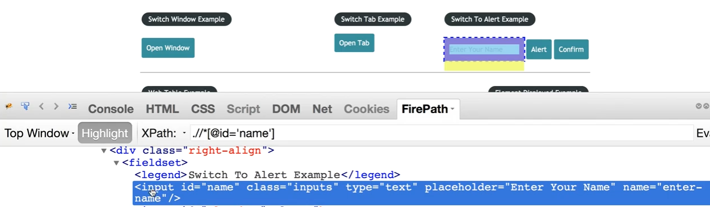
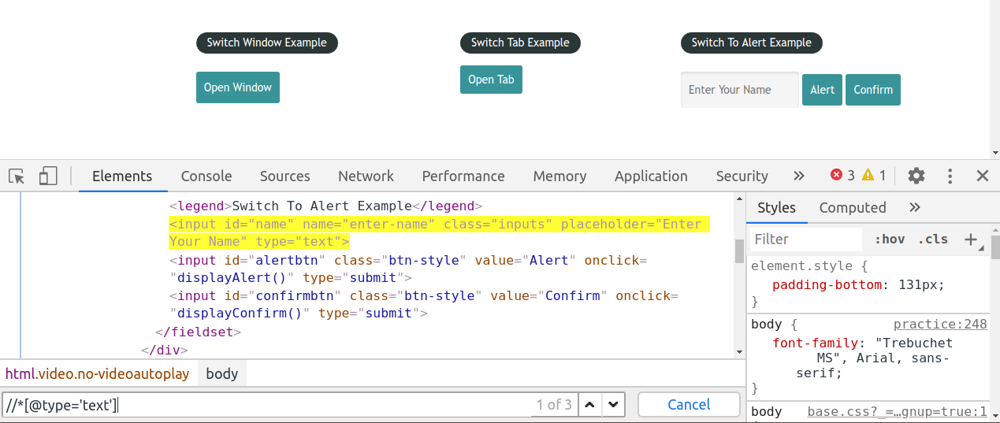
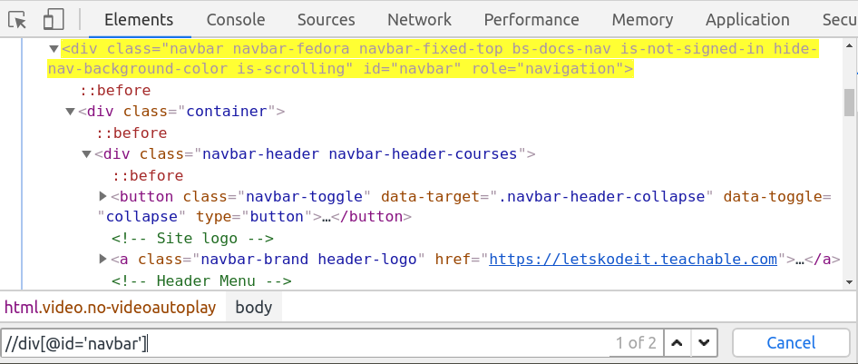
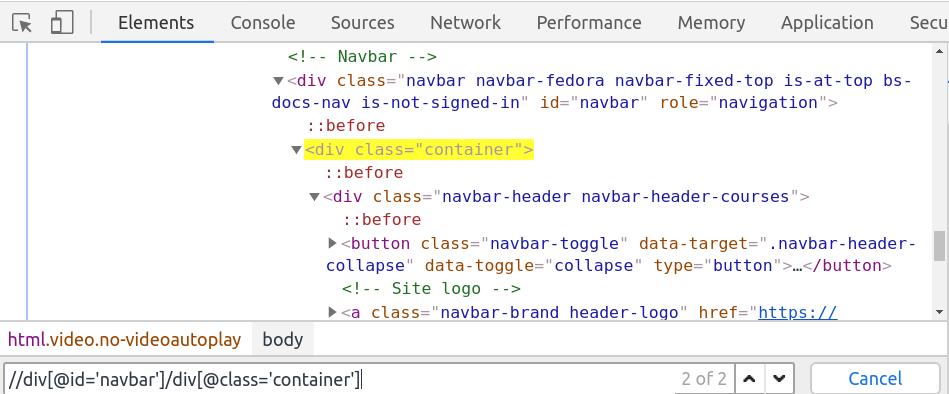
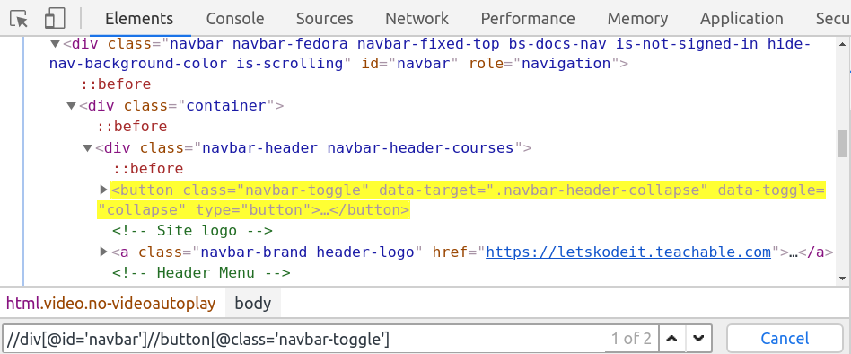
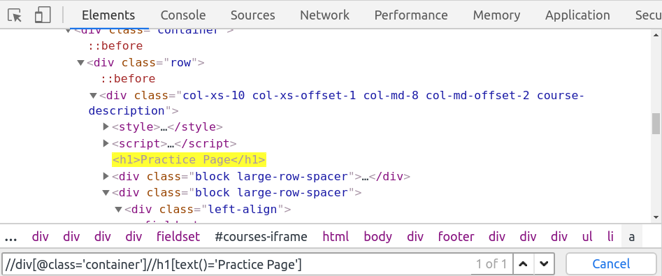
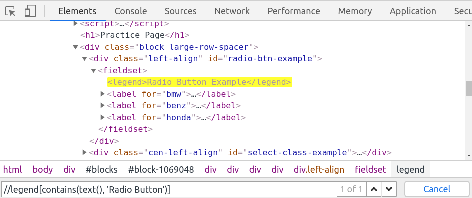

# Understanding Elements and DOM
- use chrometools and use inspect

# Find Element By Id


```py
from selenium import webdriver

class FindByIdName():

    def test(self):
        baseUrl = "https://letskodeit.teachable.com/pages/practice"
        driver = webdriver.Chrome()
        driver.get(baseUrl)
        elementById = driver.find_element_by_xpath("//*[@id='name']")

        if elementById:
            print('Found ID')

ff = FindByIdName()
ff.test()
```

# Find List of Elements

```py
from selenium import webdriver
from selenium.webdriver.common.by import By

class ListOfElements():

    def test(self):
        baseUrl = "https://letskodeit.teachable.com/pages/practice"
        driver = webdriver.Chrome()
        driver.get(baseUrl)

        text_type = driver.find_elements_by_xpath("//*[@type='text']")
        
        print(len(text_type))


ff = ListOfElements()
ff.test()
```

# XPath

> Syntax
> //tag[@attribute='value']

## // and /

### / immediate child


### // nested child


## Using Text
> Syntax
> //tag[@attribute='value']//tag[text()='Required Text']
> //tag[text()='Required Text']


## Using Contains
> Syntax
> //tag[@attribute='value']//tag[contains(attribute, 'value')]
> //tag[contains(attribute, 'Partial Text')]

