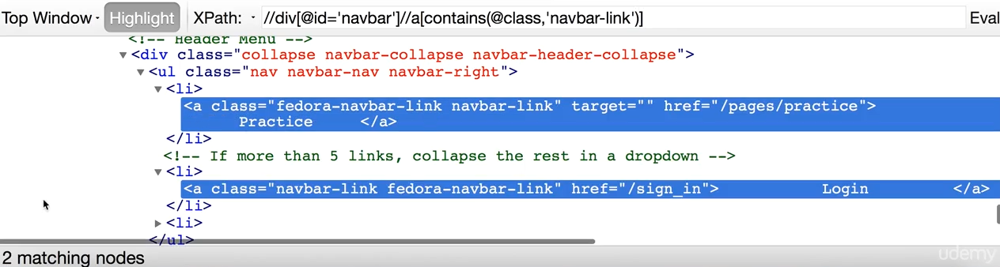

# Understanding Elements and DOM
- use chrometools and use inspect

# Find Element By Id


```py
from selenium import webdriver

class FindByIdName():

    def test(self):
        baseUrl = "https://letskodeit.teachable.com/pages/practice"
        driver = webdriver.Chrome()
        driver.get(baseUrl)
        elementById = driver.find_element_by_xpath("//*[@id='name']")

        if elementById:
            print('Found ID')

ff = FindByIdName()
ff.test()
```

# Find List of Elements

```py
from selenium import webdriver
from selenium.webdriver.common.by import By

class ListOfElements():

    def test(self):
        baseUrl = "https://letskodeit.teachable.com/pages/practice"
        driver = webdriver.Chrome()
        driver.get(baseUrl)

        text_type = driver.find_elements_by_xpath("//*[@type='text']")
        
        print(len(text_type))


ff = ListOfElements()
ff.test()
```

# XPath

> Syntax

> //tag[@attribute='value']

## // and /

### / immediate child


### // nested child


## Using Text
> Syntax

> //tag[@attribute='value']//tag[text()='Required Text']

> //tag[text()='Required Text']


## Using Contains
> Syntax

> //tag[@attribute='value']//tag[contains(attribute, 'value')]

> //tag[contains(attribute, 'Partial Text')]





## Using Starts-with
> Syntax

> //tag[starts-with(attribute, 'value')]


## Simplify xpath


## Parent and sibling

> Syntax

> xpath-to-some-element//parent::<tag>

> xpath-to-some-element//preceding-sibling::<tag>

> xpath-to-some-element//following-sibling::<tag>


### Parent


### Preceding sibling


### Following-sibling


## Exercise
1. Find the price of the course "Python Programming Language" in http://letskodeit.teachable.com/pages/practice


2. Find atuhor of the book "The Green Mile" in http://dhtmlx.com/docs/products/dhtmlxGrid/	


# Browser interactions
1. click
2. send keys
3. drag and drop
4. upload file
  
# Click on Element

## Find login link


## Clink login link
```py
from selenium import webdriver
from selenium.webdriver.common.by import By

class ClickAndSendKeys():

    def test(self):
        baseUrl = "https://letskodeit.teachable.com"
        driver = webdriver.Firefox()
        driver.maximize_window()
        driver.get(baseUrl)
        driver.implicitly_wait(10)

        loginLink = driver.find_element(By.XPATH, "//div[@id='navbar']//a[@href='/sign_in']")
        loginLink.click()

ff = ClickAndSendKeys()
ff.test()
```

## Find email field 


## Find password field


## Send keys on email and password fields
```py
from selenium import webdriver
from selenium.webdriver.common.by import By

class ClickAndSendKeys():

    def test(self):
        baseUrl = "https://letskodeit.teachable.com"
        driver = webdriver.Firefox()
        driver.maximize_window()
        driver.get(baseUrl)
        driver.implicitly_wait(10)

        loginLink = driver.find_element(By.XPATH, "//div[@id='navbar']//a[@href='/sign_in']")
        loginLink.click()

        emailField = driver.find_element(By.ID, "user_email")
        emailField.send_keys("test")

        passwordField = driver.find_element(By.ID, "user_password")
        passwordField.send_keys("test")


ff = ClickAndSendKeys()
ff.test()
```

## Find list of elements


## Select dropdown method if select tag exists


```py
from selenium import webdriver
from selenium.webdriver.support.select import Select

class DropdownSelect():

    def test(self):
        baseUrl = "https://letskodeit.teachable.com/pages/practice"
        driver = webdriver.Firefox()
        driver.maximize_window()
        driver.get(baseUrl)
        driver.implicitly_wait(10)

        element = driver.find_element_by_id("carselect")
        sel = Select(element)

        sel.select_by_value("benz")
        print("Select Benz by value")

        sel.select_by_index("2")
        print("Select Honda by index")

        sel.select_by_visible_text("BMW")
        print("Select BMW by visible text")

        sel.select_by_index(2)
        print("Select Honda by index")


ff = DropdownSelect()
ff.test()
```

## Hidden Elements

- hidden style="display:none;"
- show style="display:blodk'"


# Useful methods and properties

## Get text inside an element


```py
from selenium import webdriver
from selenium.webdriver.common.by import By
import time


class GetText():

    def test(self):
        baseUrl = "https://letskodeit.teachable.com/pages/practice"
        driver = webdriver.Firefox()
        driver.maximize_window()
        driver.implicitly_wait(10)
        driver.get(baseUrl)

        openTabElement = driver.find_element(By.ID, "opentab")
        elementText = openTabElement.text
        print("Text on element is: " + elementText)
        time.sleep(1)
        driver.quit()


ff = GetText()
ff.test()
```

## Get attributes


```py
from selenium import webdriver
from selenium.webdriver.common.by import By
import time


class GetAttribute():

    def test(self):
        baseUrl = "https://letskodeit.teachable.com/pages/practice"
        driver = webdriver.Firefox()
        driver.maximize_window()
        driver.implicitly_wait(10)
        driver.get(baseUrl)

        element = driver.find_element_by_id("name")
        result = element.get_attribute("type")

        print("Value of attribute is: " + result)
        time.sleep(1)
        driver.quit()


ff = GetAttribute()
ff.test()
```

## Execute javascript
```py
from selenium import webdriver
from selenium.webdriver.common.by import By
import time

class JavaScriptExecution():

    def test(self):
        driver = webdriver.Firefox()
        driver.maximize_window()
        driver.get("https://letskodeit.teachable.com/pages/practice")
        #driver.execute_script("window.location = 'https://letskodeit.teachable.com/pages/practice';")
        driver.execute_script("alert('hi');")

        # element = driver.find_element(By.ID, "name")
        element = driver.execute_script("return document.getElementById('name');")
        element.send_keys("Test")

ff = JavaScriptExecution()
ff.test()
```

## Take screenshot
```py
from selenium import webdriver
from selenium.webdriver.common.by import By
import time

class Screenshots():

    def test(self):
        baseUrl = "https://letskodeit.teachable.com/"
        driver = webdriver.Firefox()
        driver.maximize_window()
        driver.get(baseUrl)
        driver.implicitly_wait(3)

        driver.save_screenshot('img.png')

ff = Screenshots()
ff.test()
```

## Scroll up and down page
```py
from selenium import webdriver
from selenium.webdriver.common.by import By
import time

class ScrollingElement():

    def test(self):
        driver = webdriver.Firefox()
        driver.maximize_window()
        driver.get("https://letskodeit.teachable.com/pages/practice")
        driver.implicitly_wait(3)


        # Scroll Down
        driver.execute_script("window.scrollBy(0, 1000);")
        time.sleep(3)

        # Scroll Up
        driver.execute_script("window.scrollBy(0, -1000);")
        time.sleep(3)

        # Scroll Element Into View
        element = driver.find_element(By.ID, "mousehover")
        driver.execute_script("arguments[0].scrollIntoView(true);", element)
        time.sleep(2)
        driver.execute_script("window.scrollBy(0, -150);")

        # Native Way To Scroll Element Into View
        time.sleep(2)
        driver.execute_script("window.scrollBy(0, -1000);")
        location = element.location_once_scrolled_into_view
        print("Location: " + str(location))
        driver.execute_script("window.scrollBy(0, -150);")


ff = ScrollingElement()
ff.test()
```

# Switch Windows and iFrames

## Switch Window Focus


```py
from selenium import webdriver
from selenium.webdriver.common.by import By
import time

class SwitchToWindow():

    def test(self):
        baseUrl = "https://letskodeit.teachable.com/pages/practice"
        driver = webdriver.Firefox()
        driver.maximize_window()
        driver.get(baseUrl)

        # Find parent handle -> Main Window
        parentHandle = driver.current_window_handle
        print("Parent Handle: " + parentHandle)

        # Find open window button and click it
        driver.find_element(By.ID, "openwindow").click()
        time.sleep(2)

        # Find all handles, there should two handles after clicking open window button
        handles = driver.window_handles

        # Switch to window and search course
        for handle in handles:
            print("Handle: " + handle)
            if handle not in parentHandle:
                driver.switch_to.window(handle)
                print("Switched to window:: " + handle)
                searchBox = driver.find_element(By.ID, "search-courses")
                searchBox.send_keys("python")
                time.sleep(2)
                driver.close()
                break

        # Switch back to the parent handle
        driver.switch_to.window(parentHandle)
        driver.find_element(By.ID, "name").send_keys("Test Successful")


ff = SwitchToWindow()
ff.test()
```

## Switch to Frames
- iframe is another page within the page
- iframe or top window will be shown


### iframe id


### iframe name


```py
from selenium import webdriver
from selenium.webdriver.common.by import By
import time

class SwitchToFrame():

    def test(self):
        baseUrl = "https://letskodeit.teachable.com/pages/practice"
        driver = webdriver.Firefox()
        driver.maximize_window()
        driver.get(baseUrl)
        driver.execute_script("window.scrollBy(0, 1000);")

        # Switch to frame using Id
        driver.switch_to.frame("courses-iframe")

        # Switch to frame using name
        # driver.switch_to.frame("iframe-name")

        # Switch to frame using numbers
        # driver.switch_to.frame(0)

        time.sleep(2)
        # Search course
        searchBox = driver.find_element(By.ID, "search-courses")
        searchBox.send_keys("python")
        time.sleep(2)

        # Switch back to the parent frame
        driver.switch_to.default_content()
        driver.execute_script("window.scrollBy(0, -1000);")
        time.sleep(2)
        driver.find_element(By.ID, "name").send_keys("Test Successful")


ff = SwitchToFrame()
ff.test()
```

## Javascript Popups
- can not find alert box in html


- alerts are javascript functions


## buttons xpath


```py
from selenium import webdriver
from selenium.webdriver.common.by import By
import time

class SwitchToFrame():

    def test1(self):
        baseUrl = "https://letskodeit.teachable.com/pages/practice"
        driver = webdriver.Firefox()
        driver.maximize_window()
        driver.get(baseUrl)


        driver.find_element(By.ID, "name").send_keys("Anil")
        driver.find_element(By.ID, "alertbtn").click()
        time.sleep(2)
        alert1 = driver.switch_to.alert
        alert1.accept()
        time.sleep(2)
        driver.find_element(By.ID, "name").send_keys("Anil")
        driver.find_element(By.ID, "confirmbtn").click()
        time.sleep(2)
        alert2 = driver.switch_to.alert
        alert2.dismiss()


ff = SwitchToFrame()
ff.test1()
```

